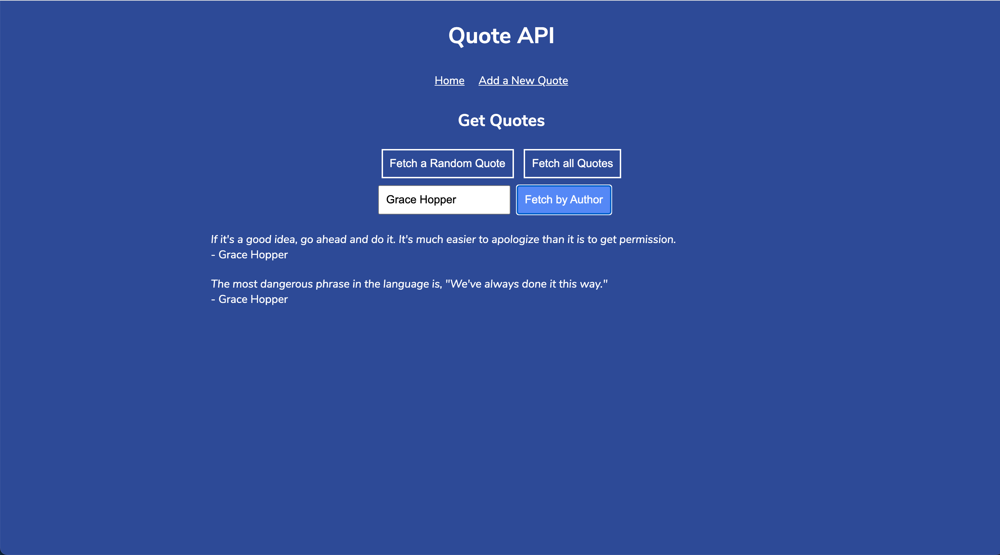

# Tech Quote Generator

A web API, built with Express and Node.js, that stores and serves quotes about computers, coding and technology.

## Table of contents

* [General info](#general-info)
* [Screenshot](#screenshot)
* [Technologies](#technologies)
* [Languages](#languages)
* [Features](#features)
* [Status](#status)
* [Inspiration](#inspiration)
* [Contact](#contact)

## General info

 This is a challenge project set as part of the Codecademy Full-Stack Engineer career path course. It builds upon the skills acquired during the 'Build a backend with Node.js and Express' module of the course.

## Screenshot

## Technologies

* Node and Node Package Manager
* Git & GitHub
* Express

## Languages

* JavaScript

## Features

The GUI allows users to:
* Generate a random quote
* Search for quotes by author
* Add a new quote
* View the full list of quotes

To-do list for future development:

* PROJECT COMPLETE

## Status

Project is: _COMPLETE_

## Inspiration

Project created as part of Codecademy Full-Stack Engineer career pathway.

An extra thank you to [Rita Łyczywek](https://www.flynerd.pl/) for this excellent README template

## Contact

Created by [@jlopenshaw](https://twitter.com/Jlopenshaw) - feel free to contact me about the project
